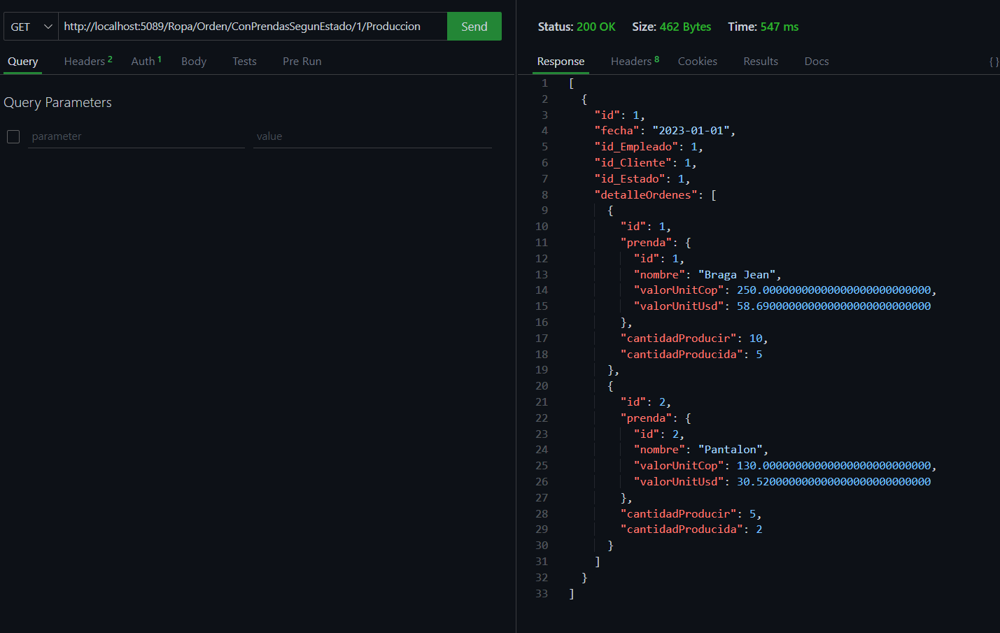
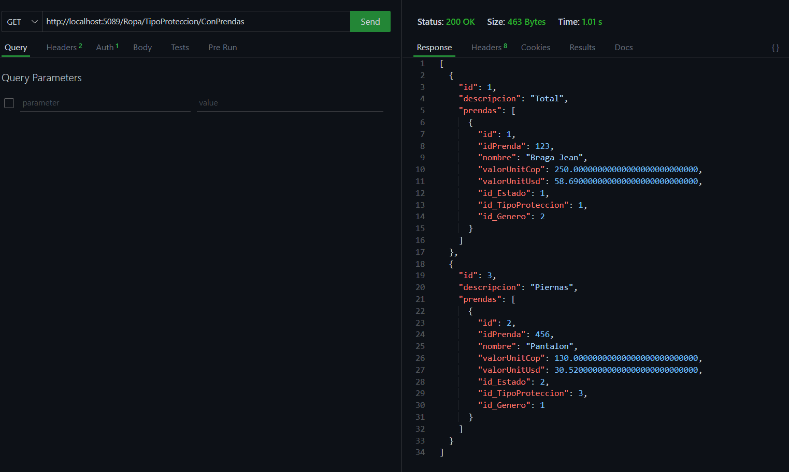
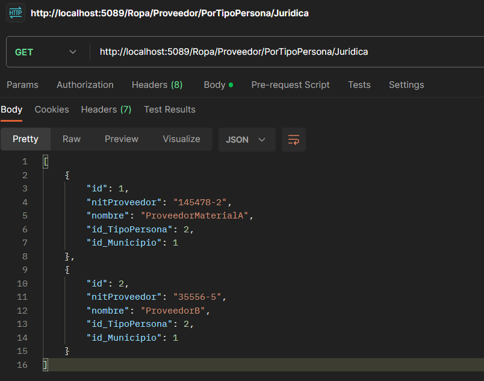

# Caso Safe Clothing

La empresa safe clothing desea realizar un backend que le permita llevar el control, registro y seguimiento de la producción de prendas de seguridad industrial, la empresa cuenta con diferentes tipos de prendas entre las cuales están las prendas resistentes al fuego (Ignifugas), resistentes a altos voltajes (Arco eléctrico). La empresa lo contrata a usted como experto backend para que cumpla con los siguientes requerimientos de desarrollo.

- Implementar restricción de peticiones haciendo uso de limitaciones de peticiones por IP.
- Implementar protección a los endPoints haciendo uso de JWT y roles de usuario.
- Implementar esquema de versionado de Api que facilite el proceso de implementación de nuevos endpoints sin afectar el funcionamiento de las aplicaciones externas que consumen los servicios del Api.
- Implementar endpoints que permitan realizar el proceso de CRUD en cada uno de los controladores del backend.
- Debido al gran volumen de información que la empresa procesa diariamente se requiere que los endpoints encargados de consultar el contenido de las tablas implementen sistema de paginación.

### Listar las prendas de una orden de producción cuyo estado sea en producción. El usuario debe ingresar el número de orden de producción.
```Json
http://localhost:5089/Ropa/Orden/ConPrendasSegunEstado/{numeroOrden}/{estadoProduccion}
```


### Listar las prendas agrupadas por el tipo de protección.

```Json
http://localhost:5089/Ropa/TipoProteccion/ConPrendas
```

### Listar los proveedores que sean persona natural.

```Json
http://localhost:5089/Ropa/Proveedor/PorTipoPersona/{tipopersona}
```


